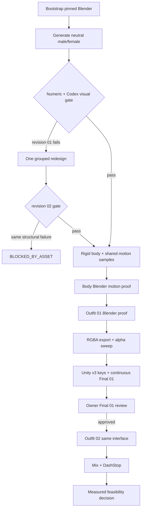

# LGO Fully Automated Rigid Outfit Pilot Implementation Plan

> **For agentic workers:** REQUIRED SUB-SKILL: Use superpowers:executing-plans to implement this plan task-by-task. Steps use checkbox (`- [ ]`) syntax for tracking.

**Goal:** Codex tự động tạo source nhân vật nam/nữ và hai outfit, dựng rigid rig, xuất sprite RGBA, tích hợp Unity và tạo Player evidence; owner chỉ cần duyệt Final #1 theo gate đã khóa.

**Architecture:** Một Blender 4.5 LTS scene là editable source duy nhất. Python tạo body/outfit thành các object 3D cứng có hidden overlap, parent một object vào đúng một bone, render từng part bằng cùng camera thành PNG RGBA, rồi Unity gắn các sprite đó vào cùng canonical skeleton bằng position/rotation. Design gate kiểm hình toàn thân trước khi rig/outfit; source gate, Unity invariant và visual Player gate chạy tuần tự.

**Tech Stack:** Blender 4.5.13 LTS Apple Silicon + Python API, Python 3.12 + Pillow + `unittest`, Unity 6000.3.2f1, Unity Test Framework 1.4.3, SpriteRenderer, SortingGroup, ffmpeg.

**Spec:** `docs/execution/LGO-RIGID-OUTFIT-PILOT-GOAL.md`

**Method assessment:** `docs/art/LGO-SINGLE-IMAGE-MODULAR-RIG-ASSESSMENT-2026-09-15.md`

**Capability evidence:** `build/rigid-outfit-pilot/capability-evidence/evidence-index-v1.json`. Tool/runtime infrastructure is proven; production source art is explicitly not proven yet.

## Global Constraints

- Canvas duy nhất: `lgo_character_canvas_1024x1536_v1`, 1024×1536, origin X 512, ground Y 1484, `u=1.70/1536` world unit/pixel.
- Candidate v9 SHA-256 `b8d27811164ca7f190d2796f3231528a7a91ca7727ae26e8ed591e7890fa05fb` là authority cho identity, tỷ lệ và neutral stance; chỉ dùng làm đối chiếu, không cắt hoặc chiếu pixel lên source.
- QA được phép tạo silhouette mask từ v9 để so contour/envelope. Mask này mang role `REFERENCE_QA_ONLY`, không được pack, rig hoặc dùng làm body/equipment sprite.
- Bộ sáu pose cũ của owner là authority cho run contact A/B, high-knee A/B và jump-tuck silhouette.
- Blender source dùng object geometry riêng cho từng part. Cấm flat card, capsule limb, weighted mesh, Armature modifier, vertex group deformation, shape key, lattice, warp và scale key.
- Mỗi body/outfit object parent vào đúng một bone bằng rigid transform; object và bone scale phải `(1,1,1)` sau khi apply bind transforms.
- Render part dùng cùng một orthographic camera, light rig, source canvas và bind pose. PNG phải là RGBA thật, không nền caro nung vào ảnh.
- Unity chỉ nhận PNG RGBA + manifest; runtime chỉ dùng `SpriteRenderer`, `Transform` và `SortingGroup`.
- Animation không chứa sprite/equipment binding hoặc scale. Equipment code không đọc state, phase, frame hoặc joint angle.
- Outfit #2 dùng lại đúng part interface, bone, pivot và fit fingerprint của outfit #1; không đo lại body hoặc thêm offset riêng.
- Không mở class/level/migration trước Final #1, outfit #2, mix và animation mới.
- Machine PASS chỉ mở visual review. Final #1 chỉ đạt khi Codex đã xem contact sheet/MP4 và owner duyệt.
- Design/source cùng một lỗi cấu trúc qua hai revision thì dừng giả thuyết tự động và báo `BLOCKED_BY_ASSET`; không tạo revision thứ ba bằng nắn số.
- Không khảo sát thêm Krita, Spine, Comfy hoặc ImageGen trong batch này. Blender là công cụ source duy nhất.
- Apple Vision result chỉ là evidence intake: không thay landmark v9, không cắt part, không tạo hidden geometry và không thêm vào runtime dependency.
- Cấm angle-dependent joint sprites như `elbow.straight/mid/high`; một seam cover hợp lệ phải là cùng một sprite tồn tại xuyên suốt mọi frame.

---

## Căn cứ chính thức và kết luận áp dụng

1. Blender 4.5 là nhánh LTS đang được duy trì; bản 4.5.13 cho macOS ARM64 và checksum chính thức nằm trong thư mục release của Blender: <https://www.blender.org/download/lts/> và <https://download.blender.org/release/Blender4.5/>.
2. Blender hỗ trợ automation/batch/render bằng command line. Mọi generator/audit chạy `--background --factory-startup --python ... --python-exit-code 2`, vì vậy lỗi Python không thể bị hiểu nhầm là thành công: <https://docs.blender.org/manual/en/4.5/advanced/command_line/index.html> và <https://docs.blender.org/manual/en/4.5/advanced/command_line/arguments.html>.
3. Blender object có thể parent trực tiếp vào bone bằng `parent_type='BONE'`. Pilot dùng parenting này và cấm Armature modifier/weights: <https://docs.blender.org/api/current/bpy.types.Object.html>.
4. Blender Film Transparent và render passes hỗ trợ output có alpha, nên checkerboard không cần xuất hiện trong pixel source: <https://docs.blender.org/manual/en/4.5/render/eevee/render_settings/film.html> và <https://docs.blender.org/manual/en/4.5/render/layers/passes.html>.
5. Unity Transform hỗ trợ hierarchy parent–child; `SetParent(parent, false)` giữ local relationship do manifest cung cấp: <https://docs.unity3d.com/ja/6000.0/ScriptReference/Transform.html> và <https://docs.unity3d.com/ja/6000.0/ScriptReference/Transform.SetParent.html>.
6. Unity mô tả `SpriteSkin` là component làm biến dạng Sprite. Nó phải bị validator reject: <https://docs.unity3d.com/ja/Packages/com.unity.2d.animation%4013.0/api/UnityEngine.U2D.Animation.SpriteSkin.html>.
7. Sorting Group gom multi-sprite character thành một nhóm render và cho phép order nội bộ deterministic: <https://docs.unity3d.com/cn/6000.0/Manual/sprite/sorting-group/sorting-group-landing.html>.
8. `AnimationUtility.GetCurveBindings` và `GetObjectReferenceCurveBindings` cho phép validator kiểm cả scale curves lẫn sprite-reference curves: <https://docs.unity3d.com/2022.3/Documentation/ScriptReference/AnimationUtility.GetCurveBindings.html> và <https://docs.unity3d.com/2022.3/Documentation/ScriptReference/AnimationUtility.GetObjectReferenceCurveBindings.html>.
9. Spine khuyên tách mỗi phần chuyển động độc lập, vẽ phần bị che và bo đầu joint. Đây là đối chứng authoring cho object geometry, không phải đổi runtime sang Spine: <https://esotericsoftware.com/spine-images> và <https://esotericsoftware.com/blog/How-to-cut-your-assets-for-animation>.
10. SAM2 tạo mask từ point/box/mask prompt và Grounded-SAM-2 ghép text grounding với SAM2; chúng không tạo hidden geometry hoặc skeleton ownership. Cài đặt Grounded-SAM-2 local chính thức dùng PyTorch/CUDA và khuyến nghị CUDA/Linux, nên không được coi là capability production đã sẵn sàng trên Apple Silicon hiện tại: <https://github.com/facebookresearch/sam2> và <https://github.com/IDEA-Research/Grounded-SAM-2>.
11. Krita AI Diffusion cung cấp inpaint/ControlNet/IP-Adapter qua ComfyUI, nhưng cần backend/model và cảnh báo hardware ngoài NVIDIA có thể chậm hoặc lỗi. Đây là candidate-generation capability, không phải proof về hidden joint surface: <https://github.com/Acly/krita-ai-diffusion>.
12. Unity Sprite Library/Resolver có thể swap sprite theo Category + Label. Pilot không thêm surface này vì binder trực tiếp đã tồn tại; nếu đánh giá sau pilot, Resolver chỉ được gọi khi equip và mọi animation binding tới resolver/sprite vẫn bị cấm: <https://docs.unity3d.com/Packages/com.unity.2d.animation@13.0/manual/SLAsset.html> và <https://docs.unity3d.com/Packages/com.unity.2d.animation@13.0/api/UnityEngine.U2D.Animation.SpriteResolver.html>.
13. Apple Vision cung cấp body pose và foreground instance mask, nhưng Apple nêu các hạn chế khi chủ thể cúi/lộn/bị che/mặc đồ rộng. Probe LGO thật nhận 19 point nhưng lệch core RMS `44.00/43.37 px` và head confidence thấp, nên chỉ được dùng làm future intake seed: <https://developer.apple.com/documentation/vision/detecthumanbodyposerequest>, <https://developer.apple.com/documentation/vision/generateforegroundinstancemaskrequest> và <https://developer.apple.com/videos/play/wwdc2020/10653/>.
14. Rive Unity render qua RenderTexture và không phải drop-in SpriteRenderer; Moho giải quyết rig sau khi có layered source; Cartoon Animator 5 không có macOS. Không nhánh nào giải quyết current source-art blocker tốt hơn Blender route đã được probe: <https://rive.app/docs/game-runtimes/unity/faq>, <https://www.lostmarble.com/moho/manual/scriptsmenu.html> và <https://kb.reallusion.com/Product/53088/Why-is-Cartoon-Animator-5-only-available-for-Windows-OS-and-not-for-Mac-OS>.

## Phản biện lựa chọn

### A. KRA/ORA native painting

Source và layer contract tốt, nhưng Codex chưa có capability vẽ production art tự động. Chọn đường này sẽ quay lại phụ thuộc designer, trái yêu cầu mới.

### B. Single image → SAM2 masks → inpaint → rigid parts

Kiến trúc item/part đúng, nhưng chuỗi công cụ chưa đủ làm source production tự động. SAM2 chỉ tách pixel đang nhìn thấy; nó không suy ra near/far ownership hoặc phần joint bị che. Inpaint tạo pixel giả định và vẫn cần rotation sweep để chứng minh. Grounded-SAM-2 local không có đường cài Apple Silicon chính thức tương đương CUDA/Linux, còn Krita/ComfyUI cần model/workflow chưa được kiểm chứng trong sandbox. Không mở đường này trong pilot. Chi tiết: `docs/art/LGO-SINGLE-IMAGE-MODULAR-RIG-ASSESSMENT-2026-09-15.md`.

### C. Blender volumetric rigid-source generator — chọn

Khác thử nghiệm mannequin cũ ở bốn điểm kiểm được: source là volume có silhouette được author bằng profile riêng; body được xem toàn thân trước khi tách/render; mỗi part có hidden 3D overlap; không có weight/deformation. Nhược điểm là art tự động vẫn có thể không đủ đẹp, nên design gate đứng trước rig và chỉ cho tối đa hai grouped revision.

### D. Apple Vision + custom flat cutout builder

Probe trên male/female v9 chứng minh Vision nhận được một body, 19 point và một foreground instance mỗi ảnh. Sai số landmark core còn khoảng 44 px và whole-foreground mask không có semantic part ownership. V9 đã có landmark profile tốt hơn, nên Vision không nằm trên critical path hiện tại. Đẩy dài pixel/card dưới torso cũng lặp lại failure mode flat-card/capsule đã bị owner bác.

### E. Moho hoặc Rive

Moho có giá trị khi layered source đã tồn tại nhưng chưa được cài và không giải quyết hidden art. Rive thay SpriteRenderer/SortingGroup path bằng RenderTexture renderer. Cả hai chỉ đổi downstream tool đã được Blender/Unity proof, không tháo current blocker. Không dùng trong pilot.

### F. Sáu pose + angle-based joint correction

Sáu pose cũ chỉ làm key silhouette reference. Final #1 vẫn phải chạy interpolation và transition liên tục. Angle-based elbow/knee sprite selection là pose-dependent swap, vi phạm goal và không được dùng.

---

## File map

### Toolchain và source generator

- Create: `tools/bootstrap_lgo_blender.py` — tải, checksum, mount và cài Blender 4.5.13 vào build toolchain.
- Create: `tools/test_bootstrap_lgo_blender.py` — test URL/checksum parsing/command construction không cần tải mạng.
- Create: `tools/lgo_blender_rigid_chibi_source.py` — tạo material, camera, body, face, hair, outfit, skeleton, actions và `.blend`.
- Create: `tools/test_lgo_blender_rigid_chibi_source.py` — test pure geometry/profile/manifest helpers.
- Create: `tools/extract_lgo_reference_silhouette.py` — tạo mask QA-only từ clean v9 và tính contour/envelope; không xuất runtime source.
- Create: `tools/test_extract_lgo_reference_silhouette.py` — self-match, background/shadow exclusion và role guard.
- Create: `tools/audit_lgo_blender_rigid_source.py` — audit reopen, hierarchy, modifiers, scale, camera, geometry ownership và alpha.
- Create: `tools/test_audit_lgo_blender_rigid_source.py` — negative fixtures cho weight, shape key, wrong parent và non-unit scale.
- Create: `tools/export_lgo_blender_rigid_sprites.py` — render body/outfit part RGBA và emit trim/pivot/hash manifest.
- Create: `tools/test_export_lgo_blender_rigid_sprites.py` — test trim/pivot/alpha/hash bằng fixture PNG.
- Create: `tools/capture_lgo_rigid_outfit_v3.py` — build Unity, chạy graphics Player, encode MP4/contact sheet và validate manifest.
- Create: `tools/test_capture_lgo_rigid_outfit_v3.py` — zero-frame, command và evidence tests.

### Data contracts

- Create: `docs/art/data/lgo-rigid-chibi-design-profile-v1.json` — proportions, camera, materials, per-part contour ratios và design limits.
- Create: `docs/art/data/lgo-rigid-body-bind-profile-v1.json` — bone positions, part pivots, joint radii và ROM do Blender exporter sinh.
- Create: `docs/art/data/lgo-rigid-outfit-interface-vo-v1.json` — slot/part/bone/pivot/sort contract dùng chung outfit #1/#2.
- Create: `docs/art/LGO-RIGID-AUTOMATED-DESIGN-REVIEW-v1.md` — visual checklist và two-revision rule.

### Editable source ngoài repo

- Create: `/Users/minhdc/Projects/Design/LGO-Selected-2D-Source-v1/class-work-in-progress/common-character-chibi-v1/rigid-outfit-autogen-v1/lgo-rigid-chibi-source-v1.blend`.
- Create: `/Users/minhdc/Projects/Design/LGO-Selected-2D-Source-v1/class-work-in-progress/common-character-chibi-v1/rigid-outfit-autogen-v1/source-generation-report.json`.
- Create: `/Users/minhdc/Projects/Design/LGO-Selected-2D-Source-v1/class-work-in-progress/common-character-chibi-v1/rigid-outfit-autogen-v1/source-design-profile-v1.json`.

### Unity

- Create: `client/Unity/Assets/Game/Character/Runtime/Rigid2D/RigidSourceManifest.cs`.
- Modify: `client/Unity/Assets/Game/Character/Runtime/Rigid2D/RigidCharacterSkeleton.cs`.
- Modify: `client/Unity/Assets/Game/Character/Runtime/Rigid2D/RigidOutfitBinder.cs`.
- Modify: `client/Unity/Assets/Game/Character/Runtime/Rigid2D/RigidOutfitPilotActor.cs`.
- Modify: `client/Unity/Assets/Game/Character/Runtime/Rigid2D/RigidOutfitPilotCatalog.cs`.
- Modify: `client/Unity/Assets/Game/Character/Runtime/Rigid2D/RigidMotion.cs` only when a source-visible motion defect is confirmed.
- Modify: `client/Unity/Assets/Game/Character/Runtime/Rigid2D/RigidOutfitPilotPlayer.cs`.
- Create: `client/Unity/Assets/Game/Character/Editor/Rigid2D/RigidMotionSampleExporter.cs`.
- Modify: `client/Unity/Assets/Game/Character/Editor/Rigid2D/RigidOutfitPilotBuilder.cs`.
- Modify: `client/Unity/Assets/Game/Character/Editor/Rigid2D/RigidOutfitInvariantValidator.cs`.
- Create: `client/Unity/Assets/Game/Character/Tests/EditMode/RigidOutfitSourceContractTests.cs`.
- Create: `client/Unity/Assets/Game/Character/Tests/EditMode/RigidOutfitRuntimeReuseTests.cs`.
- Create: `client/Unity/Assets/Game/Character/Runtime/Resources/LGORigidPilot/v3/source-manifest.json`.
- Create: `client/Unity/Assets/Game/Character/Runtime/Resources/LGORigidPilot/v3/{male,female}/body/*.png`.
- Create: `client/Unity/Assets/Game/Character/Runtime/Resources/LGORigidPilot/v3/{outfit-01,outfit-02,weapon}/*.png`.

### Evidence, generated and untracked

- `build/rigid-outfit-pilot/autogen-v1/design-gate/`
- `build/rigid-outfit-pilot/autogen-v1/body-motion/`
- `build/rigid-outfit-pilot/autogen-v1/outfit-01/`
- `build/rigid-outfit-pilot/autogen-v1/final-01-player/`
- `build/rigid-outfit-pilot/autogen-v1/reuse/`
- `build/rigid-outfit-pilot/autogen-v1/source-motion-report.json`
- `build/rigid-outfit-pilot/autogen-v1/FEASIBILITY-REVIEW.md`

---

### Task 1: Bootstrap one pinned Blender toolchain — completed 2026-09-15

**Files:**
- Create: `tools/bootstrap_lgo_blender.py`
- Create: `tools/test_bootstrap_lgo_blender.py`
- Create: `tools/probe_lgo_blender_rigid_capabilities.py`
- Create: `tools/test_probe_lgo_blender_rigid_capabilities.py`

**Interfaces:**
- Produces: `bootstrap(output_root: Path) -> dict` with executable, version, archive SHA-256 and codesign result.
- Produces: a disposable `INFRASTRUCTURE_CAPABILITY_ONLY` `.blend` plus fresh-process reopen/alpha audit. It is never a character candidate.

- [x] **Step 1: Write failing checksum and command tests**

```python
class BlenderBootstrapTests(unittest.TestCase):
    def test_selects_official_arm64_archive_and_checksum(self):
        release = parse_checksum_file(CHECKSUM_FIXTURE)
        self.assertEqual(release.filename, "blender-4.5.13-macos-arm64.dmg")
        self.assertEqual(len(release.sha256), 64)

    def test_probe_uses_factory_startup_and_python_exit_code(self):
        command = blender_python_command(Path("/tool/Blender"), Path("probe.py"))
        self.assertEqual(command[1:5], ["--background", "--factory-startup", "--python-exit-code", "2"])
```

- [x] **Step 2: Run and confirm red**

```bash
python3.12 -m unittest tools.test_bootstrap_lgo_blender -v
```

- [x] **Step 3: Implement official download/install**

```python
BLENDER_VERSION = "4.5.13"
ARCHIVE_NAME = "blender-4.5.13-macos-arm64.dmg"
RELEASE_ROOT = "https://download.blender.org/release/Blender4.5"

def bootstrap(output_root: Path) -> BlenderInstall:
    """Fetch archive and official sha256 list, verify, mount read-only, copy app, verify code signature/version."""
```

Install root is `build/toolchains/blender-4.5.13/Blender.app`; do not install system-wide. Verify the checksum row from `blender-4.5.13.sha256`, then run `codesign --verify --deep --strict` and `Blender --version`.

- [x] **Step 4: Run tests, bootstrap and record tool evidence**

```bash
python3.12 -m unittest tools.test_bootstrap_lgo_blender -v
python3.12 tools/bootstrap_lgo_blender.py --output-root build/toolchains --version 4.5.13
build/toolchains/blender-4.5.13/Blender.app/Contents/MacOS/Blender --version
```

Observed: `Blender 4.5.13 LTS`; official/local SHA-256 both `663ce944257c61ff1d6aa09e15c8f57bbd8d59023adb2fa7edde33a9ed960b53`; codesign verified; 5/5 bootstrap unit tests passed.

- [x] **Step 5: Prove rigid bone parenting, RGBA render and reopen in a fresh process**

Observed report: `build/rigid-outfit-pilot/capability-evidence/blender-4.5.13-rigid-rgba-v1/capability-report.json` = `BLENDER_RIGID_RGBA_REOPEN_PASS`. Three objects retained exact bone parents, unit scale, zero modifiers/vertex groups/shape keys/scale curves, and RGBA output had alpha range `0.0..0.996078`. Create/reopen PNG container hashes differ, but decoded frame MD5 is identical (`b28cf213a4095e968812715afbfc3dfa`), proving pixel-stable reopen/render. Probe geometry is diagnostic and has `runtimeEligible=false`.

Gate: `BLENDER_TOOLCHAIN_PASS` — passed. Continue with Task 2; no art claim is implied.

---

### Task 2: Lock the parametric design profile before rendering art

**Files:**
- Create: `docs/art/data/lgo-rigid-chibi-design-profile-v1.json`
- Create: `tools/lgo_blender_rigid_chibi_source.py`
- Create: `tools/test_lgo_blender_rigid_chibi_source.py`
- Create: `tools/extract_lgo_reference_silhouette.py`
- Create: `tools/test_extract_lgo_reference_silhouette.py`
- Create: `docs/art/LGO-RIGID-AUTOMATED-DESIGN-REVIEW-v1.md`

**Interfaces:**
- Produces: `load_design_profile(path: Path) -> DesignProfile`, `create_profiled_volume(...) -> bpy.types.Object`, `build_neutral_character(profile, gender) -> CharacterObjects`, `extract_reference_mask(image, exclusion) -> ReferenceMask`, `compare_silhouette(reference, candidate) -> SilhouetteMetrics`.

- [ ] **Step 1: Write profile math tests outside Blender**

```python
class DesignProfileTests(unittest.TestCase):
    def test_canvas_projection_uses_registered_origin_and_ground(self):
        self.assertEqual(world_point(512, 1484), (0.0, 0.0))
        self.assertAlmostEqual(world_point(512, 607)[1], 0.9706380208, places=8)

    def test_body_targets_come_from_v9_landmarks(self):
        profile = load_design_profile(PROFILE_FIXTURE)
        self.assertEqual(profile.design_authority_sha256, V9_SHA256)
        self.assertLessEqual(profile.projected_landmark_rms_limit_px, 12.0)
        self.assertEqual(profile.camera_yaw_degrees, 12.0)

    def test_reference_mask_can_never_become_runtime_source(self):
        mask = extract_reference_mask(V9_MALE, exclusion="ground-shadow")
        self.assertEqual(mask.role, "REFERENCE_QA_ONLY")
        self.assertFalse(mask.runtime_eligible)

    def test_silhouette_self_match_is_exact(self):
        mask = extract_reference_mask(V9_MALE, exclusion="ground-shadow")
        metrics = compare_silhouette(mask, mask)
        self.assertEqual(metrics.iou, 1.0)
        self.assertEqual(metrics.max_contour_distance_px, 0.0)
```

- [ ] **Step 2: Define exact profile constraints**

```json
{
  "profileId": "lgo_rigid_chibi_autogen_v1",
  "designAuthoritySha256": "b8d27811164ca7f190d2796f3231528a7a91ca7727ae26e8ed591e7890fa05fb",
  "canvas": [1024, 1536],
  "originX": 512,
  "groundY": 1484,
  "unitsPerPixel": 0.0011067708333333333,
  "cameraYawDegrees": 12.0,
  "cameraType": "ORTHO",
  "landmarkRmsLimitPx": 12.0,
  "groundErrorLimitPx": 2.0,
  "heightRatioErrorLimit": 0.01,
  "referenceSilhouetteRole": "REFERENCE_QA_ONLY",
  "referenceSilhouetteRuntimeEligible": false,
  "maxDesignRevisions": 2,
  "shader": "LGO_TOON_3_BAND",
  "outlineWidthPx": 3
}
```

The generator reads male/female landmark rows from the existing v9 canonical profile. Limb radii come from adjacent bone length ratios, then are constrained by the visible neutral silhouette check; they are never measured from a flat cross-section. Silhouette metrics are diagnostic: they catch gross camera/contour drift, while whole-board review owns the art decision.

- [ ] **Step 3: Implement tailored volume helpers**

```python
def create_profiled_volume(
    name: str,
    centerline: list[tuple[float, float, float]],
    radii: list[tuple[float, float]],
    depth: float,
    bevel_segments: int,
    material_name: str,
) -> "bpy.types.Object":
    """Build a closed beveled volume with authored front/back contour and no modifier left unapplied."""


def assert_not_placeholder_geometry(obj: "bpy.types.Object") -> None:
    """Reject cube/plane/card geometry, constant-radius capsule silhouette and fewer than 24 contour vertices."""
```

Create coherent head, face planes, hair clumps, neck, torso, pelvis and 12 limb pieces. Body-only design uses a neutral underlayer: male bare upper torso with stylized shorts; female fitted sleeveless underlayer and shorts. Sensitive anatomy is not drawn.

- [ ] **Step 4: Run pure tests and Blender generation smoke**

```bash
python3.12 -m unittest tools.test_lgo_blender_rigid_chibi_source -v
python3.12 -m unittest tools.test_extract_lgo_reference_silhouette -v
build/toolchains/blender-4.5.13/Blender.app/Contents/MacOS/Blender \
  --background --factory-startup --python-exit-code 2 \
  --python tools/lgo_blender_rigid_chibi_source.py -- \
  --profile docs/art/data/lgo-rigid-chibi-design-profile-v1.json \
  --mode neutral-design \
  --output build/rigid-outfit-pilot/autogen-v1/design-gate/revision-01
```

Expected: one male/female neutral board, one dimension overlay, one JSON report and one `.blend`; no exploded sheet.

Gate: files exist only. Visual approval belongs to Task 3.

---

### Task 3: Run the automatic neutral-design gate

**Files:**
- Modify only if gate fails: `docs/art/data/lgo-rigid-chibi-design-profile-v1.json`
- Generate: `build/rigid-outfit-pilot/autogen-v1/design-gate/revision-{01,02}/`

**Interfaces:**
- Consumes: neutral renders and report.
- Produces: `design-review.json` with one status: `DESIGN_VISUAL_PASS`, `DESIGN_REVISION_REQUIRED`, `AUTOMATED_DESIGN_HYPOTHESIS_REJECTED`.

- [ ] **Step 1: Run deterministic numeric checks**

```text
projected landmark RMS <= 12 px
both feet ground error <= 2 px
male/female source height-ratio error <= 1%
root/pelvis X = 512 px after projection
yaw = 12 degrees, facing right
all source object scales = (1,1,1)
reference masks are REFERENCE_QA_ONLY and absent from export manifests
silhouette comparison has no gross disconnected island or joint-zone collapse
```

- [ ] **Step 2: Codex opens and reviews the whole board**

Use `view_image` on neutral board and dimension overlay. Review these rows together: identity, head/neck attachment, slight outward angle, human idle stance, opposing arm/leg readability, natural body-only silhouette, chibi appeal, no visible ball/capsule joints, belt plane location and available clothing overlap zones.

- [ ] **Step 3: Decide once per revision**

If every numeric and visual row passes, write `DESIGN_VISUAL_PASS` and continue. If not, write one grouped defect list with categories `PROPORTION`, `CAMERA`, `SILHOUETTE`, `ANATOMY`, `JOINT_ZONE`, `STYLE`; adjust the design profile/source functions in one revision and generate revision 02.

- [ ] **Step 4: Enforce the two-revision cap**

If revision 02 repeats any structural category, write `AUTOMATED_DESIGN_HYPOTHESIS_REJECTED`, move both revisions under `build/rigid-outfit-pilot/rejected-iterations/autogen-volumetric-rigid-source-v1/`, update state to `BLOCKED_BY_ASSET`, and stop. Do not rig, outfit or run Unity on a failed design.

Gate: `DESIGN_VISUAL_PASS` is mandatory.

---

### Task 4: Build rigid skeleton, body ownership and motion proof in Blender

**Files:**
- Create: `client/Unity/Assets/Game/Character/Editor/Rigid2D/RigidMotionSampleExporter.cs`
- Modify: `tools/lgo_blender_rigid_chibi_source.py`
- Create: `tools/audit_lgo_blender_rigid_source.py`
- Create: `tools/test_audit_lgo_blender_rigid_source.py`
- Create: `docs/art/data/lgo-rigid-body-bind-profile-v1.json`

**Interfaces:**
- Unity produces: `build/rigid-outfit-pilot/autogen-v1/motion-samples.json` with 15 named keys and 212 continuous combo samples from `RigidMotionLibrary`.
- Blender consumes those samples and produces two armatures with identical bone names plus rigid-parented body objects.

- [ ] **Step 1: Write the Unity motion export test**

```csharp
[Test]
public void MotionSampleExportContainsNoScaleOrEquipmentData()
{
    var report = RigidMotionSampleExporter.BuildReport();
    Assert.That(report.KeyPoses.Count, Is.EqualTo(15));
    Assert.That(report.ComboPoses.Count, Is.EqualTo(RigidOutfitPilotComboPlan.Frames.Count));
    Assert.That(report.Json, Does.Not.Contain("scale"));
    Assert.That(report.Json, Does.Not.Contain("sprite"));
    Assert.That(report.Json, Does.Not.Contain("outfit"));
}
```

- [ ] **Step 2: Export exact C# motion samples**

```bash
LGO_RIGID_MOTION_SAMPLE_OUTPUT="$PWD/build/rigid-outfit-pilot/autogen-v1/motion-samples.json" \
  /Applications/Unity/Hub/Editor/6000.3.2f1/Unity.app/Contents/MacOS/Unity \
  -batchmode -nographics -quit -projectPath "$PWD/client/Unity" \
  -executeMethod LinhGioi.Character.Editor.RigidMotionSampleExporter.Export \
  -logFile build/rigid-outfit-pilot/autogen-v1/motion-export.log
```

Expected: 15 key poses, 212 combo poses, root translation and bone rotation/position only.

- [ ] **Step 3: Create exact canonical bone hierarchy**

```text
CharacterRoot
  Pelvis
    Torso
      Chest
        Neck
          Head
        ShoulderL > UpperArmL > ElbowL > LowerArmL > WristL > HandL
        ShoulderR > UpperArmR > ElbowR > LowerArmR > WristR > HandR
    HipL > UpperLegL > KneeL > LowerLegL > AnkleL > FootL
    HipR > UpperLegR > KneeR > LowerLegR > AnkleR > FootR
```

Create one male and one female armature with identical semantics. Parent each body object to exactly one bone using `parent_type='BONE'`; do not add Armature modifiers or weights.

- [ ] **Step 4: Add hidden overlap at every articulation**

For each joint `P`:

```text
Rb = ceil(Wb/2 + 3 + 2 + 2)
parent volume extends behind P by Rb pixels in projected source space
child volume encloses the projected circle B(P,Rb)
```

The body surface can interpenetrate inside hidden regions; the rendered outside contour must remain natural.

- [ ] **Step 5: Write negative audit tests**

```python
class RigidSourceAuditTests(unittest.TestCase):
    def test_rejects_deforming_modifier(self):
        self.assertIn("DEFORMING_MODIFIER", audit_fixture("armature-modifier.blend").issue_codes)

    def test_rejects_multi_bone_or_unparented_part(self):
        self.assertIn("RIGID_PARENT_CONTRACT", audit_fixture("wrong-parent.blend").issue_codes)

    def test_rejects_scale_key_and_shape_key(self):
        report = audit_fixture("scale-shapekey.blend")
        self.assertIn("ANIMATED_SCALE", report.issue_codes)
        self.assertIn("SHAPE_KEY_FOUND", report.issue_codes)
```

- [ ] **Step 6: Generate and audit body motion**

```bash
build/toolchains/blender-4.5.13/Blender.app/Contents/MacOS/Blender \
  --background --factory-startup --python-exit-code 2 \
  --python tools/lgo_blender_rigid_chibi_source.py -- \
  --profile docs/art/data/lgo-rigid-chibi-design-profile-v1.json \
  --motion build/rigid-outfit-pilot/autogen-v1/motion-samples.json \
  --mode body-motion \
  --output build/rigid-outfit-pilot/autogen-v1/body-motion
python3.12 tools/audit_lgo_blender_rigid_source.py \
  --blend build/rigid-outfit-pilot/autogen-v1/body-motion/lgo-rigid-chibi-source-v1.blend \
  --output build/rigid-outfit-pilot/autogen-v1/body-motion/source-audit.json
```

- [ ] **Step 7: Reopen `.blend` in background and render 15 keys + continuous combo**

The audit launches a fresh Blender process, proves hierarchy survives reopen, renders 15-key sheets and a 24 fps combo. Codex reviews both sexes for four-phase opposing run, high knee, jump anticipation/air/land, roll tuck/open, head/neck attachment, ground contact and unchanged proportions.

Gate: `BLENDER_BODY_MOTION_VISUAL_PASS`.

---

### Task 5: Generate outfit #1 and weapon as rigid source objects

**Files:**
- Create: `docs/art/data/lgo-rigid-outfit-interface-vo-v1.json`
- Modify: `tools/lgo_blender_rigid_chibi_source.py`
- Generate in source `.blend`: collections `OUTFIT_01_MALE`, `OUTFIT_01_FEMALE`, `WEAPON_01`.

**Interfaces:**
- Produces: one shared interface fingerprint and slot bundles `torso_outfit`, `lower_tunic`, `sleeves`, `gloves`, `waist_sash`, `boots`, `weapon`.

- [ ] **Step 1: Lock the visual-part interface**

```text
torso_outfit: tunic.back.far@Torso, tunic.torso@Torso, collar@Chest
lower_tunic: tunic.lower.back@Pelvis, tunic.lower.front@Pelvis
sleeves: sleeve.far.upper@UpperArmR, bracer.far@LowerArmR,
         sleeve.near.upper@UpperArmL, bracer.near@LowerArmL
gloves: glove.far@HandR, glove.near@HandL
waist_sash: waist.sash@Pelvis, waist.jade@Pelvis
boots: boot.far.shaft@LowerLegR, boot.far.foot@FootR,
       boot.near.shaft@LowerLegL, boot.near.foot@FootL
weapon: weapon.dao@HandL
```

- [ ] **Step 2: Generate rigid garment shells around body interfaces**

Use projected garment cover radius:

```text
Rg = ceil(max(Wg/2, Wb/2 + C) + 3 + 2 + 2)
```

The generator creates short Võ tunic, natural shoulder cap, bracer lip, glove cuff, pelvis belt, split rigid lower panels, knee/boot cuff and one dao. No garment object spans two relatively moving bones.

- [ ] **Step 3: Render bind review before motion**

```bash
build/toolchains/blender-4.5.13/Blender.app/Contents/MacOS/Blender \
  --background --factory-startup --python-exit-code 2 \
  --python tools/lgo_blender_rigid_chibi_source.py -- \
  --profile docs/art/data/lgo-rigid-chibi-design-profile-v1.json \
  --motion build/rigid-outfit-pilot/autogen-v1/motion-samples.json \
  --mode outfit-01 \
  --output build/rigid-outfit-pilot/autogen-v1/outfit-01
```

Codex views body-only and dressed male/female at the same camera. If belt, torso axis, thigh coverage, sleeve seam or silhouette is wrong, correct the source/profile in one grouped revision before any motion render.

- [ ] **Step 4: Render the fixed scenario matrix**

```text
body_only
all_on
torso_outfit_off
lower_tunic_off
sleeves_off
gloves_off
waist_sash_off
boots_off
sleeves_gloves_pair
lower_tunic_waist_pair
boots_lower_legs_pair
```

Every scenario renders all 15 keys. Slot-off may remove only owned object names; body hash and all remaining slot hashes stay unchanged.

- [ ] **Step 5: Render and review continuous outfit motion**

Render the 212 shared combo samples. Codex reviews adjacent-frame boards at run contacts, jump apex/landing, attack impact and roll tuck/open. Technical audit also requires object/material/geometry hashes unchanged from first to last frame.

Gate: `BLENDER_OUTFIT_01_VISUAL_PASS`.

---

### Task 6: Export immutable RGBA sprites and source manifest

**Files:**
- Create: `tools/export_lgo_blender_rigid_sprites.py`
- Create: `tools/test_export_lgo_blender_rigid_sprites.py`
- Generate: `build/rigid-outfit-pilot/autogen-v1/outfit-01/source-export/`.

**Interfaces:**
- Produces each row: `partId`, `slotId`, `gender`, `targetBone`, `pivotPx`, `sourceCanvasRect`, `trimRect`, `sortRole`, `sortOffset`, `rgbaSha256`, `geometrySha256`, `materialSha256`, `interfaceId`.

- [ ] **Step 1: Write failing PNG contract tests**

```python
class RigidSpriteExportTests(unittest.TestCase):
    def test_trim_preserves_source_pivot(self):
        result = trim_rgba(FIXTURE_RGBA, pivot_px=(512, 668))
        self.assertEqual(result.source_canvas_rect, (0, 0, 1024, 1536))
        self.assertEqual(result.trimmed_pivot_px, (512 - result.trim_rect.x, 668 - result.trim_rect.y))

    def test_rejects_rgb_and_fully_opaque_image(self):
        self.assertIn("PNG_NOT_RGBA", validate_png(RGB_FIXTURE).issue_codes)
        self.assertIn("NO_TRANSPARENT_PIXEL", validate_png(OPAQUE_FIXTURE).issue_codes)
```

- [ ] **Step 2: Implement isolated render/export**

Use one orthographic camera and Film Transparent. Render one object at a time with flat toon lighting; retain full object geometry, including hidden overlap. Save full-canvas RGBA for audit, compute alpha bbox, then trim without rescale and store trimmed pivot.

- [ ] **Step 3: Run export and alpha checks**

```bash
python3.12 -m unittest tools.test_export_lgo_blender_rigid_sprites -v
build/toolchains/blender-4.5.13/Blender.app/Contents/MacOS/Blender \
  --background --factory-startup --python-exit-code 2 \
  build/rigid-outfit-pilot/autogen-v1/outfit-01/lgo-rigid-chibi-source-v1.blend \
  --python tools/export_lgo_blender_rigid_sprites.py -- \
  --bundle body,outfit-01,weapon \
  --output build/rigid-outfit-pilot/autogen-v1/outfit-01/source-export
```

Expected: every visual part has at least one opaque and one transparent pixel, no checkerboard color field, no resize, valid pivot and stable hashes.

- [ ] **Step 4: Run existing alpha sweep on exported body/outfit interfaces**

```bash
python3.12 tools/audit_lgo_rigid_joint_alpha_sweep.py \
  --manifest build/rigid-outfit-pilot/autogen-v1/outfit-01/source-export/source-manifest.json \
  --profile docs/art/data/lgo-rigid-body-bind-profile-v1.json \
  --output build/rigid-outfit-pilot/autogen-v1/outfit-01/source-export/alpha-sweep
```

Gate: zero missing audited pixels over every declared ROM. The board still requires Codex visual review for contour bumps and wrong overlap.

---

### Task 7: Integrate v3 source into Unity and produce Final #1

**Files:**
- Create/modify all Unity files listed in File map.
- Create: `tools/capture_lgo_rigid_outfit_v3.py`
- Create: `tools/test_capture_lgo_rigid_outfit_v3.py`

**Interfaces:**
- `RigidSourceManifest.Parse(TextAsset json)` creates profile-driven skeleton, body and slot bundles.
- `RigidOutfitPilotActor.CaptureEquipmentSnapshot()` returns stable slot/bundle/fit/sprite fingerprints.
- Capture modes are exactly `body-only`, `outfit-01-keys`, `outfit-01-combo`, `outfit-02-combo`, `mix`, `final-matrix`.

- [ ] **Step 1: Write source mapping tests**

```csharp
[Test]
public void V3MapsEverySourcePartAndUsesCanonicalProjection()
{
    var catalog = RigidOutfitPilotCatalog.LoadRevision("v3");
    Assert.That(catalog.Male.Body.Parts.Count, Is.EqualTo(16));
    Assert.That(catalog.Female.Body.Parts.Count, Is.EqualTo(16));
    Assert.That(RigidSourceManifest.WorldPoint(512, 1484), Is.EqualTo(Vector2.zero));
    Assert.That(catalog.SourceProfile, Is.EqualTo("lgo_character_canvas_1024x1536_v1"));
}
```

- [ ] **Step 2: Write runtime reuse tests**

```csharp
[Test]
public void EveryMotionStatePreservesSpritesFitAndUnitScale()
{
    var actor = CreateV3MaleWithOutfit01();
    var before = actor.CaptureEquipmentSnapshot();
    foreach (RigidMotionState state in Enum.GetValues(typeof(RigidMotionState)))
        foreach (var phase in new[] { 0f, .25f, .5f, .75f, 1f })
            actor.Apply(state, phase);
    Assert.That(actor.CaptureEquipmentSnapshot(), Is.EqualTo(before));
    Assert.That(actor.HasUnitScale, Is.True);
    Assert.That(actor.HasForbiddenRendererComponents, Is.False);
}
```

- [ ] **Step 3: Implement profile-driven skeleton and named slots**

```csharp
public static RigidSkeletonDefinition FromManifest(RigidSourceManifest manifest, string gender);
public void Equip(string slotId, RigidVisualBundle bundle, RigidFitProfile fit);
public void Unequip(string slotId);
public IReadOnlyList<RigidSlotSnapshot> CaptureEquipmentSnapshot();
```

The v3 catalog cannot call old `ChibiSideView()` values or load `rigid-source-v2`. `Apply` reaches only `RigidCharacterAnimator`.

- [ ] **Step 4: Extend invariant validator at the real entrypoint**

Require v3 source manifest before build. Check hierarchy components, unit scale, all AnimationClip float/object bindings, source revision, per-state snapshots and absence of pose logic in equipment source. A declaration flag without valid source artifact fails.

- [ ] **Step 5: Test capture driver without launching Unity**

```python
class CaptureDriverTests(unittest.TestCase):
    def test_rejects_zero_frame_manifest(self):
        with tempfile.TemporaryDirectory() as directory:
            root = Path(directory)
            write_runtime_report(root, status="TECHNICAL_PASS_VISUAL_REVIEW_REQUIRED", combo_frame_count=0)
            with self.assertRaisesRegex(CaptureError, "zero frames"):
                validate_capture(root)

    def test_visual_player_command_has_no_nographics(self):
        command = make_player_command(Path("Pilot.app"), "outfit-01-combo", Path("evidence"))
        self.assertNotIn("-nographics", command)
```

- [ ] **Step 6: Copy source-gated PNG/manifest into v3 Resources**

Use importer: Sprite single, alpha transparency, mipmap off, no NPOT rescale, uncompressed pilot texture, PPU `903.5294117647`. Derive Unity sprite pivot from `trimmedPivotPx`; do not hand-edit pivots in Inspector.

- [ ] **Step 7: Run Unity tests once after the coherent integration batch**

```bash
python3.12 -m unittest tools.test_capture_lgo_rigid_outfit_v3 -v
./tools/unity_batch_test.sh
```

Expected: test count is nonzero and failures are zero. Green permits capture only.

- [ ] **Step 8: Capture body and cheap key sheets**

```bash
python3.12 tools/capture_lgo_rigid_outfit_v3.py \
  --mode body-only \
  --output build/rigid-outfit-pilot/autogen-v1/final-01-player/body-only
python3.12 tools/capture_lgo_rigid_outfit_v3.py \
  --mode outfit-01-keys \
  --output build/rigid-outfit-pilot/autogen-v1/final-01-player/outfit-01-keys
```

Codex opens every sheet. Any source/body/outfit problem returns to its owning Blender task; only confirmed motion/transition defects change `RigidMotion.cs`.

- [ ] **Step 9: Capture continuous Final #1**

```bash
python3.12 tools/capture_lgo_rigid_outfit_v3.py \
  --mode outfit-01-combo \
  --output build/rigid-outfit-pilot/autogen-v1/final-01-player/outfit-01-combo
```

Required 24 fps sequence: idle → accelerate → fast run → run/jump/land/run → run/attack/run → run/roll/run → recover idle. Codex views MP4, full contact sheet and adjacent-frame boards. Run must have opposing limbs/high knee; jump and roll preserve proportions and root rotation identity; outfit cannot gap, morph, pop, slide or change sprite.

Gate: `FINAL_01_VISUAL_REVIEW_READY`. Stop here for owner review exactly as previously required.

---

### Task 8: Generate outfit #2 using the same interface after Final #1 approval

**Files:**
- Modify: `tools/lgo_blender_rigid_chibi_source.py`
- Generate in `.blend`: `OUTFIT_02_MALE`, `OUTFIT_02_FEMALE`.
- Create resources: `client/Unity/Assets/Game/Character/Runtime/Resources/LGORigidPilot/v3/outfit-02/*.png`.
- Modify: `client/Unity/Assets/Game/Character/Runtime/Rigid2D/RigidOutfitPilotCatalog.cs`.
- Modify: `client/Unity/Assets/Game/Character/Tests/EditMode/RigidOutfitRuntimeReuseTests.cs`.

**Interfaces:**
- Consumes the exact `lgo-rigid-outfit-interface-vo-v1` fingerprint.
- Produces a different visual design with byte-identical attachment rows.

- [ ] **Step 1: Generate design variation from the same shell interfaces**

Change palette, trim, collar ornament, waist ornament and armor detail. Reuse every part ID, target bone, pivot, fixed local position/rotation and sort role. Body generator and body profile are read-only in this task.

- [ ] **Step 2: Enforce reuse in tests**

```csharp
[Test]
public void Outfit02ReusesOutfit01FitObjectAndPartBoneMap()
{
    var catalog = RigidOutfitPilotCatalog.LoadRevision("v3");
    Assert.That(ReferenceEquals(catalog.Outfit01.Fit, catalog.Outfit02.Fit), Is.True);
    Assert.That(catalog.Outfit02.Bundle.Parts.Select(p => (p.PartId, p.TargetBone)),
        Is.EqualTo(catalog.Outfit01.Bundle.Parts.Select(p => (p.PartId, p.TargetBone))));
}
```

- [ ] **Step 3: Run Blender source/motion/export gates unchanged**

```bash
build/toolchains/blender-4.5.13/Blender.app/Contents/MacOS/Blender \
  --background --factory-startup --python-exit-code 2 \
  --python tools/lgo_blender_rigid_chibi_source.py -- \
  --profile docs/art/data/lgo-rigid-chibi-design-profile-v1.json \
  --motion build/rigid-outfit-pilot/autogen-v1/motion-samples.json \
  --mode outfit-02 \
  --output build/rigid-outfit-pilot/autogen-v1/reuse/outfit-02
```

Generate the same all-on/slot-off/seam/15-key/combo evidence. Codex reviews it; no body measurement or attachment change is allowed.

- [ ] **Step 4: Capture outfit #2 in Player**

```bash
./tools/unity_batch_test.sh
python3.12 tools/capture_lgo_rigid_outfit_v3.py \
  --mode outfit-02-combo \
  --output build/rigid-outfit-pilot/autogen-v1/reuse/outfit-02-player
```

Record measured source generation, render, Unity integration and correction times separately.

---

### Task 9: Prove mix-and-match and a new skeleton-only animation

**Files:**
- Modify: `client/Unity/Assets/Game/Character/Runtime/Rigid2D/RigidMotion.cs`.
- Modify: `client/Unity/Assets/Game/Character/Runtime/Rigid2D/RigidOutfitPilotPlayer.cs`.
- Modify: `client/Unity/Assets/Game/Character/Tests/EditMode/RigidOutfitRuntimeReuseTests.cs`.

- [ ] **Step 1: Add `DashStop` using bone position/rotation only**

```csharp
public enum RigidMotionState
{
    Idle, Walk, Run, Jump, Attack, Roll, Hit, DashStop
}
```

- [ ] **Step 2: Build mixed loadouts**

```text
mix-A: outfit-02 torso/lower/waist + outfit-01 sleeves/gloves/boots
mix-B: outfit-01 torso/lower/waist + outfit-02 sleeves/gloves/boots
```

- [ ] **Step 3: Assert animation and equipment independence**

Capture slot snapshots before and after every state including DashStop for male/female and both mixes. Require same bundle, sprite and fit fingerprints, part counts and unit scale.

- [ ] **Step 4: Run final mix capture**

```bash
./tools/unity_batch_test.sh
python3.12 tools/capture_lgo_rigid_outfit_v3.py \
  --mode mix \
  --output build/rigid-outfit-pilot/autogen-v1/reuse/mix-player
```

Codex reviews seam pairs at Idle, Run contact A/B, Jump apex, Attack impact, Roll tuck and DashStop impact, plus a continuous mixed clip per sex.

Gate: `REUSE_AND_NEW_ANIMATION_VISUAL_PASS`.

---

### Task 10: Final report, state and bounded migration decision

**Files:**
- Generate: `build/rigid-outfit-pilot/autogen-v1/source-motion-report.json`.
- Generate: `build/rigid-outfit-pilot/autogen-v1/FEASIBILITY-REVIEW.md`.
- Modify: `docs/execution/NEXT-ACTION.md`.
- Modify: `docs/execution/PROJECT-STATE.md`.
- Modify: `docs/execution/TASK-LEDGER-ROLLUP.md`.
- Modify: `build/codex-autopilot/status.json`.

- [ ] **Step 1: Aggregate facts from artifacts**

Report exact `.blend` path/hash/reopen status, body/outfit object counts, rendered sprite hashes, Unity states run, invariant results, outfit #2 reuse fingerprint, remaining visual issues and measured seconds for generator work, Blender render, Unity integration, correction and waiting for review.

- [ ] **Step 2: Run final checks sequentially**

```bash
python3.12 -m unittest \
  tools.test_bootstrap_lgo_blender \
  tools.test_lgo_blender_rigid_chibi_source \
  tools.test_audit_lgo_blender_rigid_source \
  tools.test_export_lgo_blender_rigid_sprites \
  tools.test_capture_lgo_rigid_outfit_v3 -v
./tools/unity_batch_test.sh
python3.12 tools/capture_lgo_rigid_outfit_v3.py \
  --mode final-matrix \
  --output build/rigid-outfit-pilot/autogen-v1/final-matrix
python3.12 tools/report_lgo_change_budget.py --enforce
git diff --check
git status --short
```

Do not run capture gates concurrently because they share Player/build outputs. Open every final contact sheet and MP4 after capture.

- [ ] **Step 3: Choose one factual decision**

- `ACCEPTED`: all technical and visual gates pass; open one Võ production slice.
- `FIX_REQUIRED`: exact source/motion/render issue remains and has not repeated twice.
- `BLOCKED_BY_ASSET`: automatic design repeats a structural visual failure in revision 02.
- `BLOCKED_BY_RUNTIME`: Blender source passes but Unity build/Player/capture cannot execute.

Do not estimate the full wardrobe. Use measured outfit #1/#2 time to decide the next same-family item.

- [ ] **Step 4: Commit one coherent checkpoint after required gates**

```bash
git add tools client/Unity/Assets/Game/Character docs
git commit -m "feat(character): prove automated rigid outfit pilot"
```

Generated toolchains, caches, Unity Library/Temp/Logs and bulky evidence remain untracked.

---

## Linear automatic flow



## Immediate-stop matrix

| Observation | Return point | Allowed correction | Forbidden correction |
| --- | --- | --- | --- |
| Neutral render looks mannequin/capsule | Design profile/source | One grouped silhouette/anatomy redesign | Rigging or outfit on failed body |
| Identity/camera/proportion mismatch | Design profile | Camera/profile/contour revision | Project v9 pixels onto parts |
| Body gap or round bump | Body source geometry | Cap/underlap/visible contour | Runtime offset or scale |
| Outfit gap | Outfit shell | Garment cover/segmentation | Skin pixels in equipment |
| One object needs two bones | Outfit interface | Split rigid object | Armature modifier/weights |
| RGB/opaque output | Exporter/render config | Film alpha/render fix | Checkerboard keying |
| Transition pop | Skeleton motion | Rotation arc/timing | Sprite swap |
| Revision 02 repeats structure fault | Automatic hypothesis | Preserve evidence and stop | Numeric revision 03 |

## Definition of Final #1

Final #1 exists only when all statements are true for male and female with outfit #1:

- `.blend` reopens headless with complete object hierarchy, materials, camera and actions.
- Body/outfit objects have one bone parent, unit scale, no weights, deformation modifier or shape key.
- Exported parts are RGBA with stable geometry/material/sprite hashes and valid pivots.
- Body-only and slot-off boards remain natural, complete and correctly layered.
- Same sprite and fit fingerprints persist across every Unity motion state.
- Continuous 24 fps Player clip shows opposing four-phase run, high knee, jump anticipation/air/land, attack and tuck/open roll without root spin.
- No joint gap, ball-joint silhouette, proportion change, pop, slide, wrong draw order or outfit damage is visible.
- Codex has visually inspected all evidence and owner has approved the Final #1 clip.
